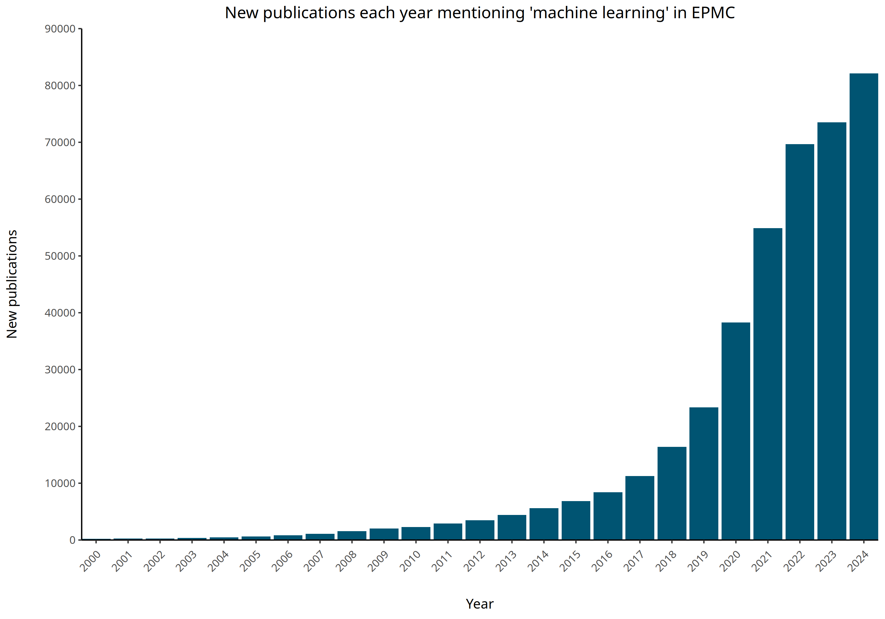

# ML Papers Graphing

This project consists of a Jupyter Notebook and an R script to analyze the number of new Europe PMC (EPMC) articles mentioning the term "machine learning". The notebook allows for user input to explore other terms as well. The output is saved as a CSV file, which is then processed by an R script to generate a graph.

## Jupyter Notebook

The Jupyter Notebook (`ML_papers_graphing.ipynb`) allows users to input a query term and retrieve the number of EPMC articles mentioning that term from the year 2000 to the current year. The results are saved in a CSV file named `query_results.csv`.

## R Script

The R script (`graph.R`) reads the `query_results.csv` file and generates a line plot showing the number of hits per year. The plot is saved as a PNG file named `New_publications.png` in ELIXIR Europe blue colors.

## Usage

1. **Run the Jupyter Notebook**:
   - Open `ML_papers_graphing.ipynb` in Jupyter Notebook or JupyterLab.
   - Enter the query term in the input field and run the notebook cells.
   - The results will be saved in `query_results.csv`.

2. **Run the R Script**:
   - Open `graph.R` in RStudio or run it in an R terminal.
   - The script will read `query_results.csv` and generate the plot.
   - The plot will be saved as `New_publications.png`.

## Requirements

- Python 3.x
- Jupyter Notebook or JupyterLab
- R and RStudio
- Required R packages: `ggplot2`, `httpgd`

## Installation

1. **Install Python packages**:
   ```sh
   pip install requests ipywidgets
   ```

2. **Install R packages**:
   ```r
   install.packages("ggplot2")
   install.packages("httpgd")
   ```

## Example

Here is an example of the generated plot:


